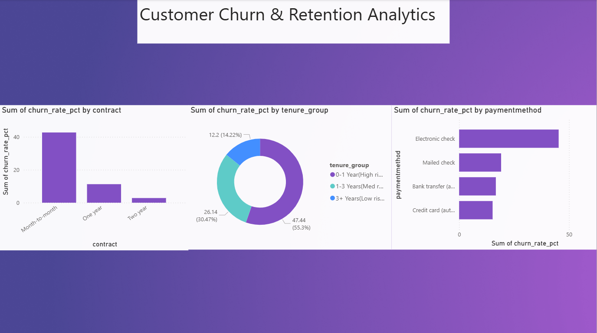

# 📉 Customer Churn & Retention Analytics

## 📌 Business Problem
A major telecommunications provider is experiencing a high rate of customer turnover, leading to significant revenue leakage. The objective of this project is to build an end-to-end analytical pipeline to process historical data, identify behavioral drivers of churn, predict high-risk customers using machine learning, and deliver actionable insights to the retention team.

## 🛠️ Tech Stack
* **Language:** Python (Pandas, NumPy, Scikit-Learn)
* **Database Engine:** DuckDB (for high-performance analytical SQL queries)
* **Visualization:** Power BI
* **Version Control:** Git & GitHub

## 🚀 Pipeline Architecture
1. **Data Ingestion & Quality Gates:** Python script utilized to programmatically audit raw CSVs for nulls and data-type mismatches prior to database insertion.
2. **Data Transformation:** Pandas leveraged to clean hidden whitespace errors and standardize schemas.
3. **Database Loading:** Pristine data loaded into a local DuckDB analytical database for fast, vectorized querying.
4. **SQL Exploratory Data Analysis (EDA):** Advanced SQL aggregations used to extract churn metrics grouped by contract type, payment method, and tenure.
5. **Predictive Modeling:** Built and evaluated a baseline Logistic Regression model using Scikit-Learn to classify at-risk customers.
6. **Executive Visualization:** Connected SQL exports to Power BI to design a professional dashboard for stakeholders.

## 📊 Key Business Insights
* Customers on **Month-to-Month contracts** using **Electronic Checks** represent the highest flight risk.
* Churn risk is heavily concentrated in the **0-1 Year (High Risk)** tenure group.
* **Recommendation:** Implement a targeted marketing campaign offering a discount to first-year, month-to-month users who switch to a 1-year contract using an auto-pay credit card.

## 📸 Executive Dashboard

## ⚙️ How to Run Locally
1. Clone the repository.
2. Install dependencies: `pip install pandas numpy duckdb scikit-learn`
3. Run scripts in order from `phase1_validation.py` through `phase4_modeling.py`.